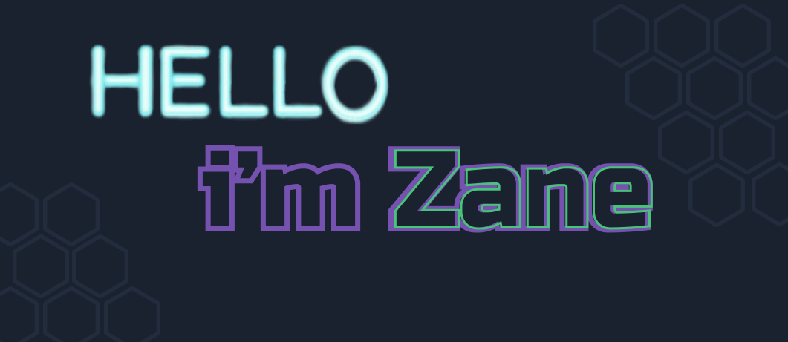

<!--  -->
<!--  -->

<!--  -->

# Hello World! 👋 

I'm all into Data Science with a passion for learning, I most enjoy Data Visualizations and 
generative artwork.

Working with data is the 21 Century gold mining, there's so much out there waiting to be
explored! 

- :rainbow: **Pronouns**: She/They
- :computer: **Coding**: R, Python
- :biking_woman: **Hobbies**: learning tech

<!-- social icons-->

<!-- links to social-->

